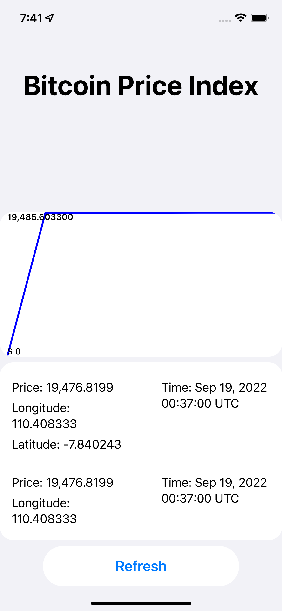

# Quadrant Assignment

Candidate: Rachmat Wahyu Pramono

## Environment Variables

To run this project, you will need to use Xcode > 13.x and iOS Simulator > 15.x 

`IPHONEOS_DEPLOYMENT_TARGET = 15.5`

## Running Project

To run project, open directory, run the following command on terminal

```bash
    open QuadrantAssignment.xcodeproj
```

## Screenshots



## Tech Stack

**Framework:** SwiftUI, Combine, CoreLocation, BackgroundTasks

**Data storage:** User Default

**Network:** URLSession

## Reference

[Mockable Property Wrapper on PreferenceWrapper](https://www.avanderlee.com/swift/property-wrappers/#accessing-a-property-wrappers-enclosing-instance)

[Best practice: iOS background processing - Background App Refresh Task](https://uynguyen.github.io/2020/09/26/Best-practice-iOS-background-processing-Background-App-Refresh-Task)

[SwiftUI 3.0 Analytics Page UI - Line Graph With Gestures](https://www.youtube.com/watch?v=uU-le4KHmow&t=929s&ab_channel=Kavsoft)
